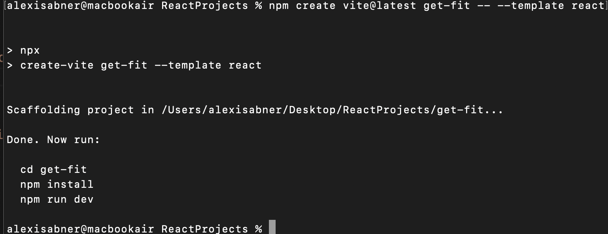
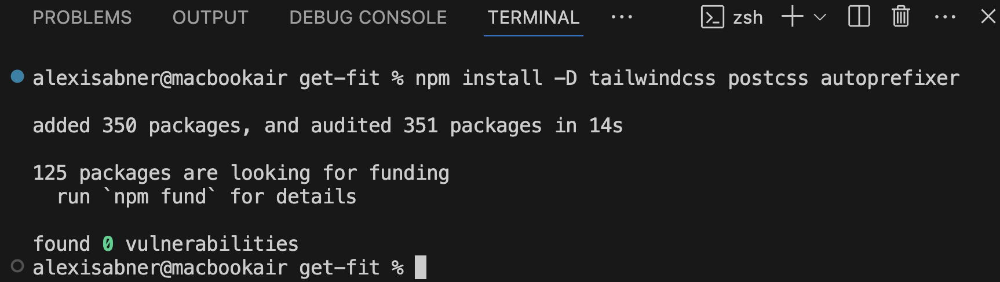

# React + Vite
[🌐 Install Tailwind CSS with Vite](https://tailwindcss.com/docs/guides/vite)
* Open terminal and type;  
`npm create vite@latest project-name -- --template react`

* Open visualstudio and open the project.

* Delete `App.css` and remove the import from `App.jsx`

* Open a terminal within VSCode.
* In terminal, type the command; `npm install -D tailwindcss postcss autoprefixer`

