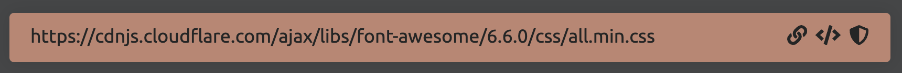

# React + Vite
[🌐 Install Tailwind CSS with Vite](https://tailwindcss.com/docs/guides/vite)
* Open terminal and type;  
`npm create vite@latest project-name -- --template react`


* Open visualstudio and open the project.

* Delete `App.css` and remove the import from `App.jsx`

* Open a terminal within VSCode.
* In terminal, type the command; `npm install -D tailwindcss postcss autoprefixer`


* Next, type the following command;  
`npx tailwindcss init -p`  


* Configure your template paths
Add the paths to all of your template files in your `tailwind.config.js` file.  (Copy and paste the  - [🌐 following](https://tailwindcss.com/docs/guides/vite))


* Delete everything inside index.css.
and add the following in it.  
```
@tailwind base;
@tailwind components;
@tailwind utilities;
```

* In terminal type `npm run dev`  
Now the environment is ready to work with.

## Adding Font from 
`https://fonts.google.com/`

- Enter the font family name in search box e.g. "Poppins"
- Select the whole family
- Copy the link 
- Add the link into index.html file inside `head` under the `title` line

## Adding Fontawesome
1. Add cdnjs link 
- Go to    [🌐 cdnjs]( https://cdnjs.com/libraries/font-awesome)

- Copy the link shown


2. Add icon/s to your project
- Go to [🌐 fontawesome](https://fontawesome.com/search?q=tailwindcss&o=r)
- Using search bar find a desired icon
- Copy its link and add it to your html file.